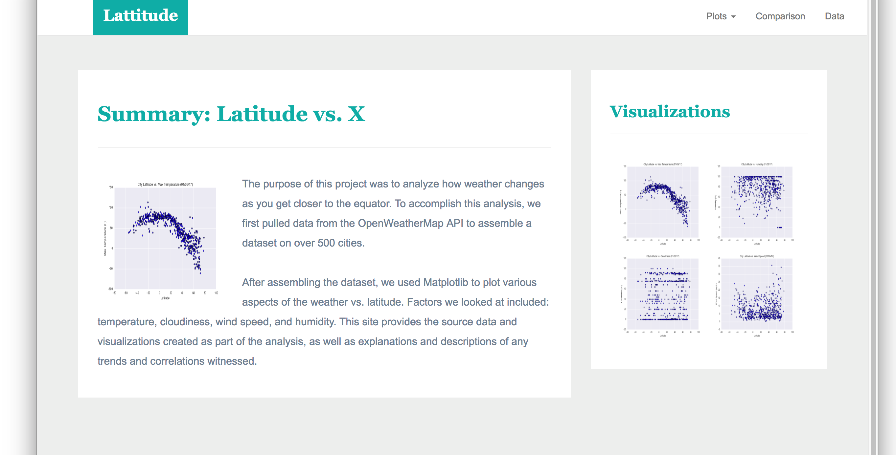
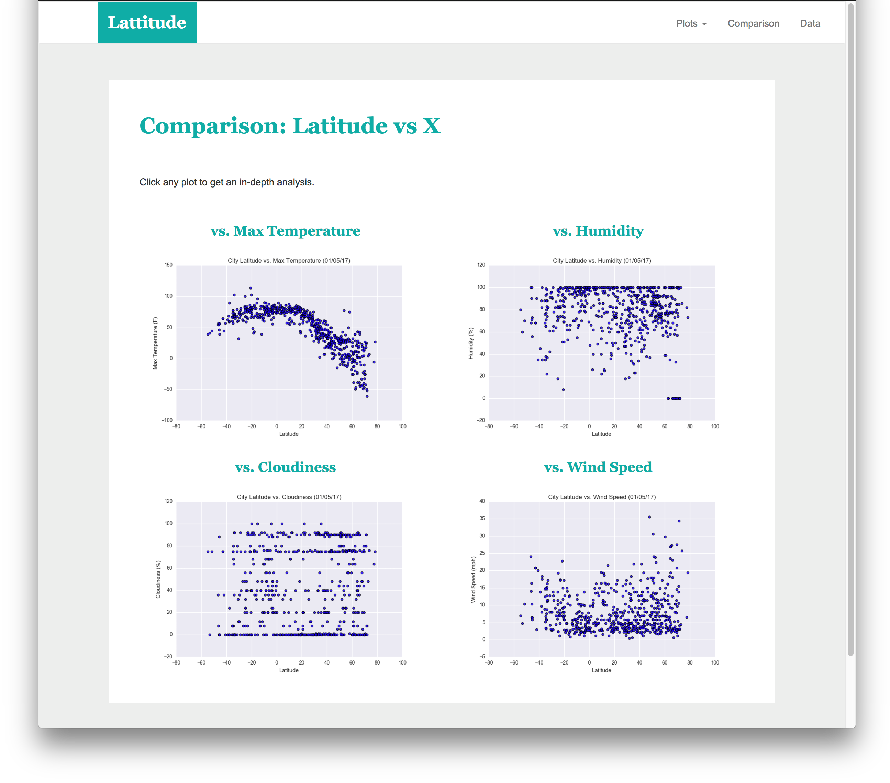
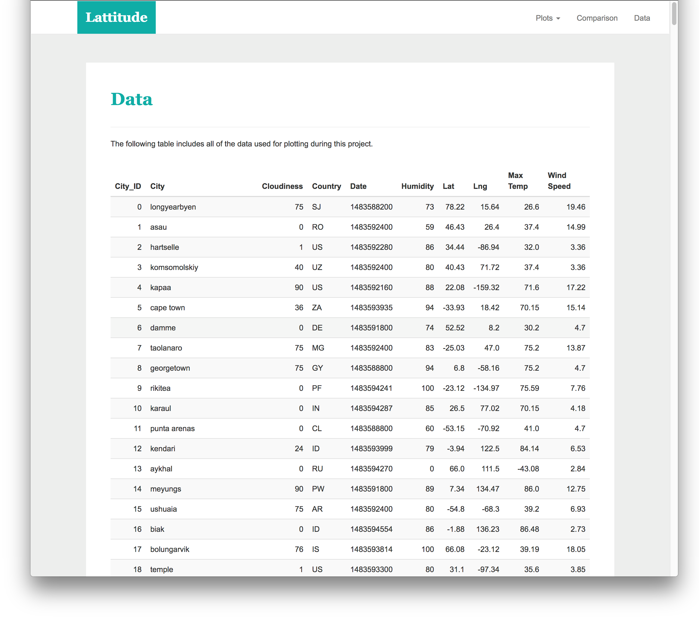
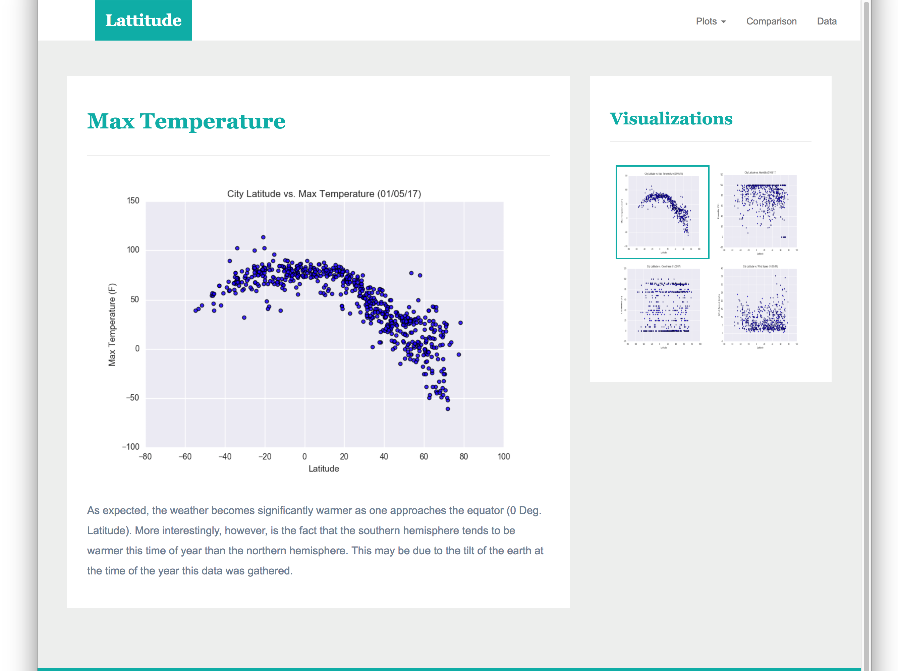

# Web-Design-Challenge
## Summary ##
This project is designed to create a visualization dashboard website. 
In this dashboard, there are several individual pages for each plot, and pages can be navigated to each other. The pages contain the visualizations and their corresponding explanations. There are also a landing page, a page where we can see a comparison of all the plots, and another page where the data were used to build them.
Dataset was cleaned by using Python and transformed to HTML format.
## Data ##
[Weather data](WebVisualizations/Resources/cities.csv)

## Tool ##
Python (Jupyter notebook), HTML, CSS
## Visualization ##
The website consist of 7 pages total, including:
#### Landing page

#### Comparisons page

#### Data page

#### 4 Visualization pages

Email:
xinlianghuang85@gmail.com
